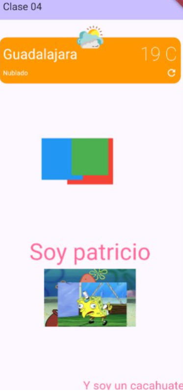
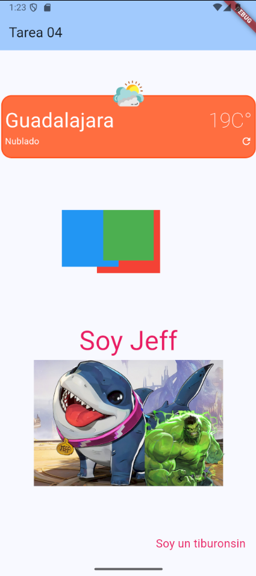

# 📱 Tarea 04 - Flutter Widgets

## 📝 Introducción
Este proyecto es una tarea de Flutter cuyo objetivo principal es practicar el uso de varios widgets para diseñar una interfaz similar a la proporcionada en la actividad.

## 🎯 Requerimientos
- Recrear el diseño proporcionado usando distintos widgets de Flutter.
- Usar estilos de textos, paddings, tamaños, posiciones y otras propiedades de los widgets.
- Implementar un `Stack` para superponer elementos.
- Manejar `Column` y `Row` para organizar los elementos en la pantalla.

## 📷 Comparación: Ejemplo vs. Implementación





## ⚙️ Instalación y Ejecución
Antes de ejecutar este proyecto, asegúrate de tener Flutter instalado y configurado.

### **1️⃣ Instalar Flutter**
Sigue la guía oficial según tu sistema operativo:
🔗 [https://docs.flutter.dev/get-started/install](https://docs.flutter.dev/get-started/install)

### **2️⃣ Clonar el Repositorio**
```bash
git clone https://github.com/TU_USUARIO/TU_REPOSITORIO.git
```
```bash
cd TU_REPOSITORIO
```

### **3️⃣ Instalar Dependencias**
```bash
flutter pub get
```

### **4️⃣ Ejecutar la Aplicación**
```bash
flutter run
```

---

## Otra forma de ejecutar el proyecto
1. Genera una aplicacion de **flutter**
   ```bash
   flutter create <nombre_app>
   ```

2. Dirigete a la carpeta `/lib`

3. Borra todo el contenido de `main.dart`

4. Pega todo el contenido de `main.dart` de este repositorio

5. Ejecutalo/Corre el proyecto


📌 **Nota:** Asegúrate de tener un emulador o un dispositivo físico conectado.

---

## Getting Started

This project is a starting point for a Flutter application.

A few resources to get you started if this is your first Flutter project:

- [Lab: Write your first Flutter app](https://docs.flutter.dev/get-started/codelab)
- [Cookbook: Useful Flutter samples](https://docs.flutter.dev/cookbook)

For help getting started with Flutter development, view the
[online documentation](https://docs.flutter.dev/), which offers tutorials,
samples, guidance on mobile development, and a full API reference.
